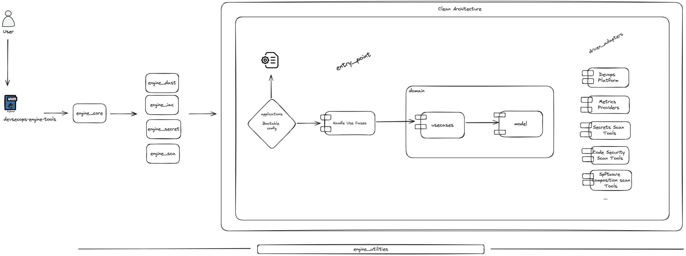

# Architecture

## Application Architecture Context

The DevSecOps Engine Tools platform is designed following Clean Architecture principles, ensuring a clear separation of concerns, high testability, and ease of maintenance. The solution is modular, scalable, automating and centralizing security, compliance, and quality processes throughout the software development lifecycle.

## Main Engines and Modules

The `tools` module is the core of the DevSecOps Engine Tools platform, providing a set of engines and utilities for security automation and integration. Its structure is organized by security domains and functionalities:

- **engine_core:** Orchestrates the main workflows, manages configuration, and coordinates the execution of differente modules and data processing.
- **engine_dast:** Handles Dynamic Application Security Testing (DAST) for runtime and API security analysis.
- **engine_integrations:** Contains adapters and connectors for integrating with external systems (e.g., Copacetic, sonarqube).
- **engine_risk:** Provides risk assessment and aggregation based on scan results and contextual information.
- **engine_sast:** Integrates and automates Static Application Security Testing (SAST) tools to analyze source code for vulnerabilities.
- **engine_sca:** Manages Software Composition Analysis (SCA) to detect vulnerabilities in dependencies and third-party libraries and images.
- **engine_utilities:** Offers shared utilities, helpers, and common logic used across engines.

**Clean Architecture Layers:**

- **Application Layer:** Initial configuration of cli and configuration to start with the call entry point.
- **Domain Layer:** Contains the core business logic, entities, and use cases, independent of Tools or external platforms.
- **Infrastructure Layer (Adapters):** Provides executions of different tools for each module (trivy, checko, nuclei, etc.).
- **Infrastructure Layer (Entry point):** Orchestrates application-specific logic, coordinating use cases and managing application flow.

The modular design allows for easy extension and integration of new tools, supporting a wide range of security and compliance use cases in CI/CD pipelines and cloud-native environments.

