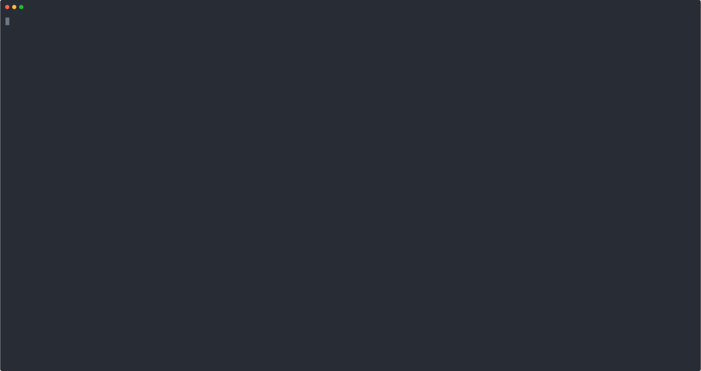
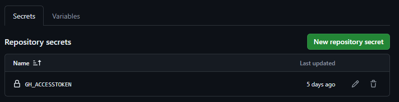
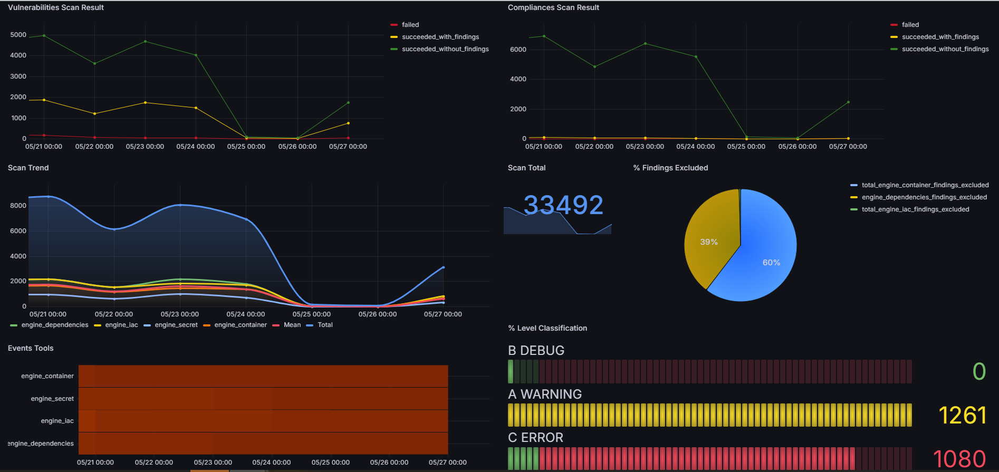
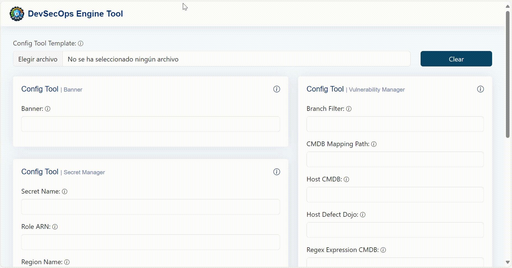

# Getting started

## Requirements

- Python >= 3.9

### Installation

```bash
pip3 install devsecops-engine-tools
```

### Configuration

- Copy [example_remote_config_local](https://github.com/bancolombia/devsecops-engine-tools/blob/trunk/example_remote_config_local/) to the location where you want to store the remote configuration (either locally or in a git repository), and the folder name or repository name would be the one you should send in the --remote_config_repo flag.

For more information about structure remote config visit [Structure Remote Config](remote_config_structure.md)

### Tools available for the modules

<table>
  <tr>
    <th>Module</th>
    <th>Tool</th>
    <th>Type</th>
  </tr>
    <tr>
    <td>ENGINE_RISK</td>
    <td><a href="https://defectdojo.com/">DEFECTDOJO</a></td>
    <td>Free</td>
  </tr>
  <tr>
    <td rowspan="3">ENGINE_IAC</td>
    <td><a href="https://www.checkov.io/">CHECKOV</a></td>
    <td>Free</td>
  </tr>
  <tr>
    <td><a href="https://kubescape.io/">KUBESCAPE</a></td>
    <td>Free</td>
  </tr>
  <tr>
    <td><a href="https://www.kics.io/">KICS</a></td>
    <td>Free</td>
  </tr>
   <tr>
    <td>ENGINE_DAST</td>
    <td><a href="https://projectdiscovery.io/nuclei">NUCLEI</a></td>
    <td>Free</td>
  </tr>
  <tr>
    <td rowspan="2">ENGINE_SECRET</td>
    <td><a href="https://trufflesecurity.com/trufflehog">TRUFFLEHOG</a></td>
    <td>Free</td>
  </tr>
  <tr>
    <td><a href="https://gitleaks.io/">GITLEAKS</a></td>
    <td>Free</td>
  </tr>
  <tr>
    <td rowspan="2">ENGINE_CONTAINER</td>
    <td><a href="https://www.paloaltonetworks.com/prisma/cloud">PRISMA</a></td>
    <td>Paid</td>
  </tr>
  <tr>
    <td><a href="https://trivy.dev/">TRIVY</a></td>
    <td>Free</td>
  </tr>
  <tr>
    <td rowspan="3">ENGINE_DEPENDENCIES</td>
    <td><a href="https://jfrog.com/help/r/get-started-with-the-jfrog-platform/jfrog-xray">XRAY</a></td>
    <td>Paid</td>
  </tr>
  <tr>
    <td><a href="https://owasp.org/www-project-dependency-check/">DEPENDENCY CHECK</a></td>
    <td>Free</td>
  </tr>
  <tr>
    <td><a href="https://trivy.dev/">TRIVY</a></td>
    <td>Free</td>
  </tr>
  <tr>
    <td>ENGINE_CODE</td>
    <td><a href="https://docs.bearer.com/quickstart/">BEARER</a></td>
    <td>Free</td>
  </tr>
</table>

### Scan running - (CLI) - Flags

```bash
devsecops-engine-tools --platform_devops ["local","azure","github"] --remote_config_source ["local","azure","github"] --remote_config_repo ["remote_config_repo"] --remote_config_branch ["remote_config_branch"] --module ["engine_iac", "engine_dast", "engine_secret", "engine_dependencies", "engine_container", "engine_risk", "engine_code"] --tool ["nuclei", "bearer", "checkov", "kics", "kubescape", "trufflehog", "gitleaks", "prisma", "trivy", "xray", "dependency_check"] --folder_path ["Folder path scan engine_iac, engine_code, engine_dependencies and engine_secret"] --platform ["k8s","cloudformation","docker", "openapi", "terraform"] --use_secrets_manager ["false", "true"] --use_vulnerability_management ["false", "true"] --send_metrics ["false", "true"] --token_cmdb ["token_cmdb"] --token_vulnerability_management ["token_vulnerability_management"] --token_engine_container ["token_engine_container"] --token_engine_dependencies ["token_engine_dependencies"] --token_external_checks ["token_external_checks"] --xray_mode ["scan", "audit","build-scan"] --image_to_scan ["image_to_scan"] --dast_file_path ["dast_file_path"] --context ["false", "true"] --terraform_repo_root ["terraform_files_repo"]
```

### Scan running sample (CLI) - Local

> Complete the value in **.envdetlocal** file a set in execution environment
```
$ set -a
$ source .envdetlocal
$ set +a
```


```bash
devsecops-engine-tools --platform_devops local --remote_config_source local --remote_config_repo DevSecOps_Remote_Config --module engine_iac

```




### Scan running sample - Azure Pipelines

Note: If the remote configuration is in an Azure Devops repository. the tool gets the token from the SYSTEM_ACCESSTOKEN variable to get the remote configuration repository. You must ensure that this token has permission to access this resource.

```yaml
name: $(Build.SourceBranchName).$(date:yyyyMMdd)$(rev:.r)

trigger:
  branches:
    include:
      - trunk
      - feature/*

stages:
  - stage: engine_tools
    displayName: Example Engine Tools
    jobs:
      - job: engine_tools
        pool:
          name: Azure Pipelines
        steps:
          - script: |
              # Install devsecops-engine-tools
              pip3 install -q devsecops-engine-tools
              devsecops-engine-tools --platform_devops azure --remote_config_source azure --remote_config_repo remote_config --module engine_iac
            displayName: "Engine Tools"
        env:
          SYSTEM_ACCESSTOKEN: $(System.AccessToken)

```

### Scan running sample - Github Actions

If remote config is in a GitHub repository, either public or private.

**If the repository is public:** 

1. The yml file containing the workflow should be configured using the default secret **GITHUB_TOKEN**. 
For more information, refer to [Automatic token authentication](https://docs.github.com/en/actions/security-guides/automatic-token-authentication).

**If the repository is private:** 

1. Create a personal access token with the necessary permissions to access the repository.
2. Add the token as a secret in the GitHub repository.
    

3. Configure the yml file containing the workflow using the created secret.

**Example of the workflow yml:**

```yaml
name: DevSecOps Engine Tools
on:
  push:
    branches:
      - main
      - feature/*
env:
  GITHUB_ACCESS_TOKEN: ${{ secrets.GH_ACCESSTOKEN }} #In this case, the remote config repository is private
  # When the remote config repository is public, the secret should be like this: ${{ secrets.GITHUB_TOKEN }}

jobs:
  release:
    runs-on: ubuntu-latest
    steps:
      - uses: actions/checkout@v4
        
      - name: Set up Python
        uses: actions/setup-python@v5
        with:
          python-version: "3.12"

      - name: Set up Python
        run: |
          # Install devsecops-engine-tools
          pip3 install -q devsecops-engine-tools
          output=$(devsecops-engine-tools --platform_devops github --remote_config_source github --remote_config_repo remote_config --module engine_iac)
          echo "$output"
          if [[ $output == *"✘Failed"* ]]; then
            exit 1
          fi
```

### Scan running sample (Docker)

> Installation

```bash
docker pull bancolombia/devsecops-engine-tools
```
```bash
docker run --rm -v ./folder_to_analyze:/folder_to_analyze bancolombia/devsecops-engine-tools:latest devsecops-engine-tools --platform_devops local --remote_config_source local --remote_config_repo docker_default_remote_config --module engine_iac --folder_path /folder_to_analyze
```

The docker image have it own default remote config with basic configuration called docker_default_remote_config, but you can define your own config and pass it as volume

```bash
docker run --rm -v ./folder_to_analyze:/folder_to_analyze -v ./custom_remote_config:/custom_remote_config bancolombia/devsecops-engine-tools:latest devsecops-engine-tools --platform_devops local --remote_config_source local --remote_config_repo custom_remote_config --module engine_iac --folder_path /folder_to_analyze
```

# Metrics

With the flag **--send_metrics true** and the configuration of the AWS-METRICS_MANAGER driven adapter in ConfigTool.json of the engine_core the tool will send the report to bucket s3. In the [metrics](https://github.com/bancolombia/devsecops-engine-tools/blob/trunk/metrics/) folder you will find the base of the cloud formation template to deploy the infra and dashboard in grafana.



# Config Tool Generator

To generate the ConfigTool.json file in a simple way, a web interface was created where you can configure each necessary parameter individually or use a base template that you want to modify. In the [config tool generator](https://github.com/bancolombia/devsecops-engine-tools/tree/trunk/remote_config_generator/config-tool-generator) folder you will find the code for the SPA created in Angular to run it local environment.



---