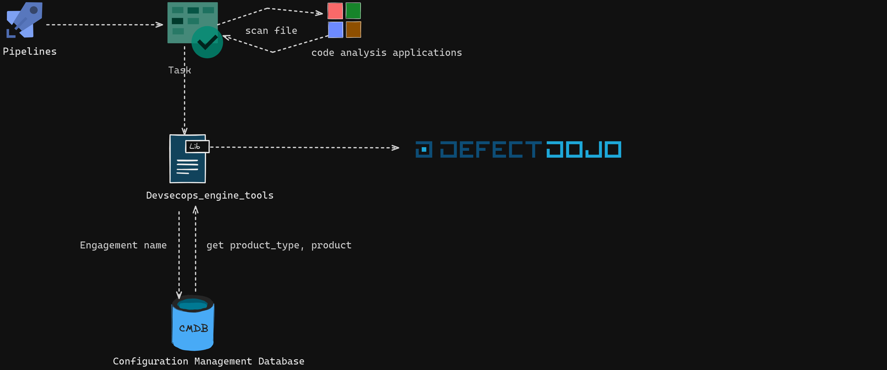
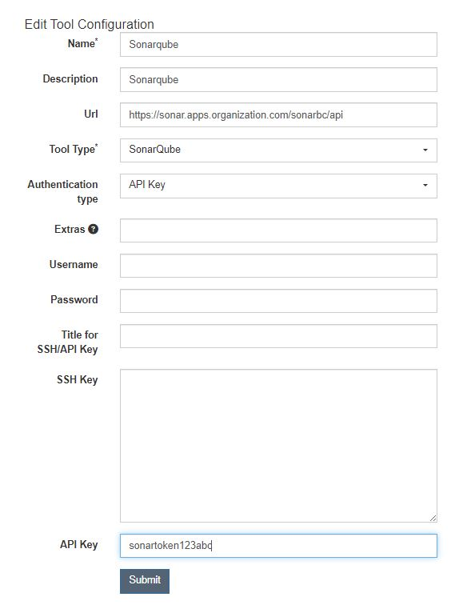

# Module Engine Utilities

## Overview

The `engine_utilities` module provides a set of shared utilities, helpers, and adapters used across the DevSecOps Engine Tools platform. These utilities support logging, data transformation, session management, Git operations, SBOM handling, SonarQube integration, and more, enabling consistent and reusable functionality throughout the platform.

## Main Responsibilities

- **Azure Devops:** Utilities and adapters for integrating with [Azure DevOps](https://azure.microsoft.com/en-us/services/devops/), including helpers for authenticating with Azure DevOps services, managing pipelines, retrieving build and release information, and automating repository operations. These utilities enable seamless interaction with Azure DevOps APIs to support CI/CD workflows and project automation.
- **Copacetic Integration:** Utilities and adapters for integrating with [Copacetic](https://github.com/project-copacetic/copacetic), including automated binary installation, container image patching, vulnerability report processing, and VEX (Vulnerability Exploitability eXchange) report generation. These utilities enable automated security patching of container images without requiring source code changes.
- **Defect Dojo:** Utilities and adapters for integrating with [Defect Dojo](https://www.defectdojo.org/), including methods for sending scan results, managing connections, and automating vulnerability imports.
- **Data Transformation:** Utilities for converting JSON responses to Python objects and vice versa, using domain language and dataclasses.
- **Git Operations:** Utilities for interacting with Git repositories, including pull request file discovery.
- **GitHub:** Utilities and adapters for integrating with [GitHub](https://github.com/), including helpers for authenticating with GitHub services, managing repositories, retrieving pull request and commit information, and automating repository operations. These utilities enable seamless interaction with GitHub APIs to support CI/CD workflows and project automation.
- **Input Validation:** Helpers for validating and sanitizing input data.
- **SBOM Handling:** Tools for generating, parsing, and managing Software Bill of Materials (SBOM).
- **SonarQube Integration:** Adapters and runners for collecting and reporting SonarQube analysis results.
- **SSH:** Utilities and adapters for managing SSH connections, executing remote commands, handling key-based authentication, and automating secure file transfers between systems.
- **Logging:** Advanced logger with color-coded output, file logging, and configurable verbosity.
- **Session Management:** Wrapper for HTTP session management to enable efficient and reusable requests.
- **Error Handling:** Utilities for standardized error reporting and exception management.

## Key Components

- `utils/`: Data transformation, logging, session management, and general helpers.
- `git_cli/`: Git operations and integration utilities.
- `sbom/`: SBOM generation and management tools.
- `sonarqube/`: SonarQube integration and reporting.
- `input_validations/`: Input validation helpers.
- `trivy_utils/`: Utilities for Trivy output parsing and management.
- `copacetic/`: Copacetic image patching, and VEX report generation.
- `settings.py`: Centralized configuration for utility modules.

## Example Usage

### Defect-Dojo-Lib Documentation

#### Architecture

The library communicates with different services, as illustrated in the following diagram:




#### Connection Configuration

To send information to Defect-Dojo, it is necessary to create a connection, which can be done using the Connect module. This module exposes functionality to create the connection object with other services integrated into the library.

The DefectDojo module exposes functionalities applicable to the Defect-Dojo app, such as the *send_import_scan* method that ingests data from vulnerabilities reported by external applications.


#### Example of Using the Defect-Dojo Module

```python
    import os
    from devsecops_engine_tools.engine_utilities.defect_dojo import DefectDojo, ImportScanRequest, Connect

    path_file = os.path.dirname(os.path.realpath(__file__))

    if __name__ == "__main__":

     request: ImportScanRequest = Connect.cmdb(
        compact_remote_config_url=https://grupotest.visualstudio.com//_git/project?path=/directory/file.json,
        cmdb_mapping={"product_type_name": "","product_name": "nombreapp","tag_product": "nombreentorno","product_description": "","codigo_app": ""}
        personal_access_token="aidfjajia3249ajfdiadjfijtest",
        token_cmdb=settings.2398298jdfa89289uj389jr3atest,
        host_cmdb="http://localhost:9000",
        expression="",
        token_defect_dojo="aijfiadsfoiajtest123",
        host_defect_dojo="http://localhost:8000",
        scan_type="Checkov Scan",
        engagement_name="ABC_TestCode",
        tags=["tag1","tag2"],
        branch_tag="master",
    )

    response = DefectDojo.send_import_scan(request)
```

**compact_remote_config_url** : is the URL of the remote file (Azure repository) that must have the specified format.

```json
        "types_product": {
        "engagement_name": "engagement_name_other",
        "engagement_name": "engagement_name_other2",
        }
```

**cmdb_mapping** is a configuration dictionary to relate keywords from information obtained from CMDB to the information that will be entered into Defect-Dojo. For example:

```json
    [
    {
        "engagement_name_cmdb": "engagement",
        "producto_name_cmdb": "product",
        "product_type_cmdb": "product_type",
        "codigo_app": "test_129342",
    }
    ]
```

- *personal_access_token :* Token generated from an Azure accoun
- *token_cmdb :* Token that allows access to CMDB
- *expression* :  Regular expression (string) to extract code from the repository.
- *token_defect_dojo* : Token generated by Defect-Dojo
- *host_defect_dojo* : URL where Defect-Dojo is deployed (for example, http://localhost.com:8000 for local execution).
- *scan_type* : Type of scanning or parser of Defect-Dojo to be used

The other parameters are configurable according to your needs and are equivalent to those received by the import_scan endpoint of Defect-Dojo, respecting the naming of the parameters and their data types. If you want to consult more information about the parameters that the method can receive, you can check the official documentation of Defect-Dojo endpoint import_scan [here](https://demo.defectdojo.org/api/v2/oa3/swagger-ui/)

#### Example of Sonar API Scan

This library supports the integration of Defect-Dojo via Sonar through API. In this specific case, it is not necessary to specify a file; Defect-Dojo connects to the Sonar API automatically as long as a prior configuration has been made..

- Creation of a tools-configuration:



In the following example, take into account the tools_configurations parameter, which is the object that allows the connection of Defect-Dojo with SonarQube. The expected value is an integer corresponding to the ID of the object in the database.

**IMPORTANT**

Note that for the tools_configurations parameter, the library takes the default value of 1.

```python
    request: ImportScanRequest = Connect.cmdb(
        compact_remote_config_url=https://grupotest.visualstudio.com//_git/project?path=/directory/file.json,
        cmdb_mapping={"product_type_name": "","product_name": "nombreapp","tag_product": "nombreentorno","product_description": "","codigo_app": ""}
        personal_access_token="aidfjajia3249ajfdiadjfijtest",
        token_cmdb=settings.2398298jdfa89289uj389jr3atest,
        host_cmdb="http://localhost",
        expression="",
        token_defect_dojo="aijfiadsfoiajtest123",
        host_defect_dojo="http://localhost:8000",
        tools_configuration=1,
        scan_type="SonarQube API Import",
        engagement_name="ABC_TestCode",
        branch_tag="master",
    )

    response = DefectDojo.send_import_scan(request)
```

#### Integration Tests

In this module, you will find the integration tests of the methods implemented in the library, which can also serve as documentation.

Navigate to the common_devsecops_lib directory and execute the following comman

    python test_integrations_defect_dojo.py


#### Config lauch.json of vscode

```json
    {
    "version": "0.2.0",
    "configurations": [
        {
            "name": "Python: Integration test",
            "type": "python",
            "request": "launch",
            "program": "${workspaceFolder}/tools/test_integrations_defect_dojo.py",
            "console": "integratedTerminal",
            "justMyCode": true
        }
    ]
}
```

### Data Transformation

#### Domain Language

This section is about how to transform a JSON file into Python objects and how we can use the utilities developed in this repository. First, we need to have a clear understanding of the structure of our JSON file, for example, if we have the following *product_types* in the following format:

```json
    {
        "count": 1,
        "next": null,
        "previous": null,
        "results": [
            {
                "id": 1,
                "name": "product_type name test1",
                "description": null,
                "critical_product": false,
                "key_product": false,
                "updated": "2023-07-11T13:29:05.233277Z",
                "created": "2023-07-11T13:29:05.233290Z",
                "members": [
                    35
                ],
                "authorization_groups": []
            },
            {
                "id": 2,
                "name": "product_type name test2",
                "description": null,
                "critical_product": false,
                "key_product": false,
                "updated": "2023-07-11T13:29:05.233277Z",
                "created": "2023-07-11T13:29:05.233290Z",
                "members": [
                    35
                ],
                "authorization_groups": []
            }
        ],
        "prefetch": {}
    }
```

This example is the response from an endpoint to query *product_types* from *Defect-Dojo*. Now, the question is, how can we translate this into the domain language? First, you need to import the *FromDictMixin* class, which implements some methods that allow us to perform the transformation into the domain language. Then, you should create a class that represents this response as follows:

```python
    import dataclasses
    from typing import List
    from devsecops_engine_tools.engine_utilities.utils.dataclass_classmethod import FromDictMixin

    @dataclasses.dataclass
    class ProductTypeList(FromDictMixin):
        count: int = 0
        next = None
        previous = None
        results: List[ProductType] = dataclasses.field(default_factory=list)
        prefetch = None

    To represent the list of *product_types*, it is necessary to create another class that represents that part of *JSON* as follows:

    @dataclasses.dataclass
    class ProductType(FromDictMixin):
        id: int = 0
        name: str = ""
        description: str = ""
        critical_product: bool = None
        key_product: bool = None
        updated: str = ""
        created: str = ""
        members: List[int] = dataclasses.field(default_factory=list)
        authorization_groups: List[None] = dataclasses.field(default_factory=list)
```

If, for example, this *ProductType* class were within a Product, it would be necessary to create a Product class. It is important to clarify that it is not necessary to implement all the attributes, you can include only those you consider necessary.

With this, we are ready to make the transformation into the domain language

#### Using the *from_dict* method

To use the *from_dict* method, which is responsible for the JSON to Python object transformation, it is invoked as follows:

```python
    product_type_list_object = ProductTypeList().from_dict(response.json())
```

With this, we will have our first Python object serialized from JSON.

#### Using the *to_dict* method

This method is responsible for transforming a Python object into *JSON*.

```python
    product_type_list_dict = ProductTypeList().to_dict(objeto)
```

### Logger

This utility allows extending the functionalities of the logger, such as changing the color depending on the logger type. It also enables logging to a text file when necessary.

A simple example of using this module is as follows:

```python
    from devsecops_engine_tools.engine_utilities.utils.logger_info import MyLogger

    logger = MyLogger.__call__(**SETTING_LOGGER).get_logger()

    logger.info("info message")
    logger.warning("warning message")
    logger.error("error message")
    logger.critical("critical message")
```

Error-type loggers are displayed in red, warning-type in yellow, and others in white.

The variable *SETTINGS_LOGGER* has the following structure:

```json
    {
        "debug": True,
        "log_file": False
    }
```

If the debug variable is active, the log messages will be displayed, otherwise, they will be deactivated.

If the log_file variable is active, a hidden ./log folder will be created, where logs will be recorded daily, separated by folders. Each folder will be named after the current date. In other words, a folder will be created daily, and within it, a log file will be created.

### Session Manager

Usage of the session wrapped in the custom class:
```python
    session = SessionManager()
```

Example of a request using the session:
```python
    response = session.get('https://www.example.com')
```

Performing more requests using the same session:
```python
    response2 = session.post('https://www.example.com/submit', data={'key': 'value'})
```

## Extensibility

- New utilities and adapters can be added to support additional tools, integrations, or data formats.
- Designed for reuse across all engines and modules in the platform.

## Testing

- Unit tests are provided in the `test/` directory, covering utility functions and adapters.